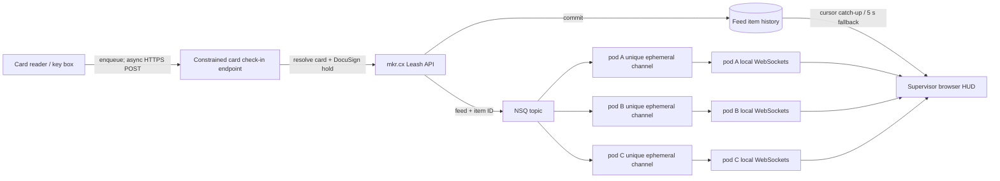

# Feed HUD architecture

This branch turns the unfinished Leash feed object into a durable, authenticated live stream for
card taps and later machine-access events. The database remains authoritative; WebSockets and NSQ
only reduce display latency.

## Canary validation — 2026-08-04

The authenticated staff HUD and asynchronous card-forwarding path were exercised with live taps in
a supervisor-only canary. Two taps completed with no pending or rejected deliveries. The latest was
persisted in 49 ms and acknowledged to the producer in 60 ms with HTTP 201 on the first attempt.
Operational verification did not read or print a raw card value or member name.

The canary used immutable images built by the official repository's passing PR workflow. Detailed
live topology, credential names, deployment overrides, and rollback commands are intentionally kept
outside this potentially public repository. Do not merge merely to preserve an imperative canary;
first reconcile the intended production-release and staging-main deployment workflow.

## API contract

- `POST /api/feeds` creates a lower-kebab-case feed name.
- `GET /api/feeds` lists only feeds the caller may read.
- `GET /api/feeds/:id` returns feed metadata.
- `DELETE /api/feeds/:id` soft-archives the feed and retains all items.
- `POST /api/feeds/:id/items` appends an item. There is intentionally no update or delete route.
- `GET /api/feeds/:id/items?after_id=N&limit=L` catches up in ascending ID order.
- `GET /api/feeds/:id/items?before_id=N&limit=L` pages older items in descending ID order.
- `GET /api/feeds/:id/ws` streams `feed_item.created` envelopes for that feed only.
- `POST /api/checkins/card` accepts a reader swipe and appends the resolved outcome to the fixed
  `signin` feed. It requires a service API key with `leash.checkins:record` and an
  `Idempotency-Key`. Its JSON body is `{ "card": "<16 hex>", "occurred_at": "<RFC3339>" }`.
  Successful first deliveries and idempotent retries both return `204 No Content`; the constrained
  producer never receives the resolved member, hold state, or stored feed item.

The name `signin` means the front-door card-tap event stream; it does not itself assert that the
person was admitted or signed in successfully. Hardware producers should supply a stable
`Idempotency-Key` per physical tap attempt. Keys are
scoped to a one-way hash of the API key (or to the signed-in user), so two readers may safely use
the same local sequence. Reusing a key for the same producer and identical content acknowledges the
original item without returning it; reusing it with different content returns `409`.

### Front-desk outcome contract

Only the active `docusign` hold affects this first HUD. The retired `orientation` hold and all
unrelated holds are deliberately ignored here; this display must not be described as a general
access-clearance decision.

| State | HUD | Stored feed content |
| --- | --- | --- |
| Linked card, no active DocuSign hold | Green; current user name; tap time | User ID plus `DocuSign complete` |
| Linked card, active DocuSign hold | Yellow; current user name; tap time | User ID plus `DocuSign required: ask them to complete the participation agreement.` |
| Card not linked | Red; tap time | No user/card identifier; `Check whether the user is registered; if so, direct them to link their UCard.` |

Unknown-card rows retain only a keyed SHA-256 fingerprint, never the card value. If that card is
linked within seven days, matching rows gain the member reference and the HUD shows the current
name. They remain red because the card was not linked at the original tap, and their message records
whether the participation agreement was complete or required at that original time. The hidden
fingerprint is erased during resolution.

The `signin` feed has a seven-day retention ceiling. Items older than seven days are excluded from
reads immediately, removed from an open HUD by its five-second maintenance poll, and hard-deleted
by the hourly server sweep. Other feed types are not given this retention rule automatically.

### Durable check-in CSV export

The short-lived HUD is not the attendance export source. Every accepted card check-in also creates
an idempotent `checkin_events` row in the same transaction as its feed item. That durable row stores
the occurrence time, outcome, source, and privacy-safe member identity, but never a card number or
card fingerprint. `checkin_identities` assigns one UUIDv4 to each mkr.cx user once; that UUID remains
stable across export date ranges and future exports.

`GET /api/checkins/export.csv?start=<RFC3339>&end=<RFC3339>` uses an inclusive start and exclusive
end. It accepts signed-in user sessions only, requires `leash.checkins:export`, limits a request to
370 days and 250,000 rows, returns `Cache-Control: no-store`, and records requester, range, and row
count in `checkin_export_audits`. API keys are deliberately rejected, including full-access keys.
The endpoint additionally requires an employee account with the staff or admin role. The permission
is never inherited from a role: it must be attached directly to each authorized person. This keeps
student staff out even if a broad role policy is added later. Use the dry-run-first
`checkin_export_access` command described in `docs/checkin-export-access.md` to grant or revoke it.

CSV fields are `event_id`, `occurred_at_utc`, `member_uuid`, `linked_at_tap`,
`identity_resolution`, `outcome`, and `source`. An unknown card has a blank member UUID. If a member
links that card during the seven-day resolution window, the durable row gains the member UUID and
`identity_resolution=later_link`, while `linked_at_tap` remains false and the original red outcome
is preserved.

This first export is intentionally pseudonymous. If an identified export is approved later, it must
use a separate permission such as `leash.checkins:export_identified`, a visibly distinct endpoint
and page, and its own audit/test review. Names or emails must not be silently added to this CSV. The
stable UUID remains the join key for separately governed registrar or self-reported datasets.

Historical card-server rows can be imported with `backend/cmd/checkin-backfill`. The command is a
dry run unless `-apply` is supplied, is idempotent by source swipe-row ID, and emits aggregate counts
only. Because the old rows do not prove ownership at tap time, a card linked to a current member at
import receives that member's stable UUID but remains `linked_at_tap=false` with
`identity_resolution=historical_current_link`; unresolved cards remain blank. See the command's
README for the reconciliation and promotion sequence.

Hold state is evaluated at `occurred_at`, including a hold removed shortly after a tap, so a delayed
outbox retry does not silently rewrite the historical result. A previously committed idempotent
retry returns that original result before resolving mutable user/hold state. A new event more than
one hour old is rejected: mkr.cx does not retain historical card-ownership data, so longer replay
could assign an old tap to a newly linked owner.

## Authorization and privacy

The first HUD is deliberately under the staff portal, so its human viewers must be staff and receive
the broad `leash.feeds:list` and `leash.feeds:read` permissions. A service account can instead be
given a least-privilege feed-specific permission such as:

- `leash.feeds.signin:append` for a trusted generic feed producer;
- `leash.feeds.signin:read` for a non-UI subscriber.

For the normal feed API, grant `leash.feeds.signin:read` to both the subscriber's service user and
its non-full-access API key, because API-key authorization intersects the owner and key policies.
Configure the numeric feed ID directly so the subscriber does not need `leash.feeds:list`.

The card reader does not receive either broad user lookup or generic feed append access. Its
dedicated service API key receives only `leash.checkins:record`; the endpoint internally resolves
the card, evaluates DocuSign, and selects the `signin` feed. This direct API-key check avoids having
to grant the permission to the service role as a whole. The key should not be full-access.

Feed creation and archival remain admin operations. A future non-staff HUD should live under the
authenticated layout and gate access directly on a feed-specific read permission.

The WebSocket authenticates with a Bearer token in its first text frame because browser JavaScript
cannot set an Authorization header during the upgrade. The server gives the socket five seconds to
authenticate, reloads the shared Casbin policy, and sends `feed.ready` only after authorization.
Before every outbound item, each process reloads each unique shared policy once, then independently
re-runs session/API-key and permission checks for every socket. This observes cross-pod revocations
without multiplying full database reloads by the number of connected displays. Casbin AutoSave
persists individual permission mutations, direct permission-list replacements use the adapter's
transactional filtered update, and startup aborts if its role/permission seed cannot be persisted.
Request handlers do not flush a pod's complete in-memory policy over changes made by another pod.

The append API does not accept `user_data`; the legacy database field remains mapped only so old
rows can be read and is never serialized to API or WebSocket clients. Producers must not put a raw
card CSN, API key, name, hold reason, or other private data into a feed title or message. A
supervisor-only presentation may resolve the existing `UserID` reference to the current display name
at read time; the name itself is not copied into immutable feed text. Unresolved card events expose
no correlation identifier. Their keyed, server-only fingerprint exists only long enough to connect
a recent red event to a later card registration, then is erased.

The current HUD renders producer titles and messages verbatim and must therefore be treated as a
staff-visible display. A screen visible to visitors needs a separately approved presentation-safe
event contract (for example, generic outcome text only) before deployment.

## NSQ topology

Configure both `NSQD_HOST` and `NSQLOOKUP_HOST` to enable cross-pod live delivery. `NSQD_HOST` is
the nsqd TCP endpoint; `NSQLOOKUP_HOST` is lookupd's HTTP endpoint, which is a different port from
the TCP endpoint nsqd uses to register itself. Startup synchronously pings both configured services.
Each pod derives its channel from `POD_UID`, then `HOSTNAME`, then the OS hostname:

`leash-feed-<pod identity>#ephemeral`

The topic is `mkrcx-feed-items-v1`. Each message is a small versioned envelope containing only the
feed ID and item ID. The consumer reloads the committed database row before broadcasting it. A
unique channel per pod is essential: multiple pods sharing one channel would load-balance events,
so only one pod would receive each tap. Ephemeral channels are appropriate because database cursor
history, not NSQ, is the durable record. Startup fails unless the producer can ping and the
consumer can subscribe directly to the configured nsqd. Lookupd remains attached for discovery and
retry; a configured pod cannot silently fall back to process-local mode. Unsafe or overlong pod
identities receive a SHA-256-derived suffix before the channel is shortened, so Kubernetes' unique
name suffix is not discarded.

When the NSQ variables are absent, the application deliberately uses process-local delivery for
development. That mode is not sufficient for a multi-pod production deployment.

## Browser behavior

The staff portal exposes `/staff/feeds` and `/staff/feeds/:id`. The HUD:

- displays the latest item first and retains the newest 100 items;
- shows the calendar date and local time for every item;
- deduplicates by database item ID;
- waits for the server's authenticated `feed.ready` acknowledgement before declaring the socket
  live or resetting bounded exponential backoff;
- catches up using ascending `after_id` pages after every reconnect, tracking an HTTP-only recovery
  cursor so an early WebSocket event cannot cause a gap to be skipped;
- polls the cursor every five seconds as a fallback if WebSocket or NSQ delivery is interrupted;
- refreshes the latest page during polling so a recently linked card updates earlier red items;
- clears rendered history and stops reconnecting on `403`, redirects through login on `401`, and
  restarts cleanly when client-side navigation selects another feed;
- reloads every six hours so the server-side layout refreshes the seven-day session before expiry.

This makes an existing managed laptop the recommended first display. A Raspberry Pi can later run
the same URL in kiosk mode without becoming a separate application or trust boundary. Discord can
also become a subscriber later, but it should not be the primary HUD because notification latency,
rate limits, presentation control, and privacy are less predictable.

### Later HUD enhancement

Show the member's current email address under their name on the staff-only HUD. Resolve it from the
existing user reference at read time, as with the display name; do not copy it into immutable feed
text or send it to non-staff subscribers by default. This is roadmap work, not part of the first
production promotion.

## Private Discord demo path

Discord should consume committed `signin` feed items downstream; the card reader must not own a
Discord token or call Discord directly. This preserves the database as the source of truth and lets
the subscriber recover transient failures from the durable feed cursor.

The local prototype is `backend/cmd/checkin-discord`. It can run on the supervisor's laptop with no
inbound/public listener or permanent front-desk hardware. It:

- polls only a configured numeric `signin` feed URL using a service user/key that both have
  `leash.feeds.signin:read`;
- posts only through a channel-scoped incoming webhook created in the supervisor-only channel;
- accepts only the three exact canonical outcome combinations, escapes display names, and disables
  Discord mentions;
- edits one rolling message containing at most the latest ten taps instead of creating an endless
  notification stream;
- advances its in-memory feed cursor only after Discord accepts the corresponding view;
- retries Discord `429` responses as directed and recreates the rolling message if it was deleted;
- never include a raw card identifier, API key, email address, hold reason, or opaque unknown-card
  identifier.

For this local demo, restarting the process intentionally creates a new rolling message and leaves
the old one in place; no attendance state is copied to a local state file. A permanent subscriber
would need separately reviewed durable cursor/message state and cleanup behavior.

MacBooks and eduroam do not need inbound connectivity for this option; supervisors use their normal
authenticated Discord clients. It still copies names and attendance timestamps to a third party,
so the private-channel membership, visible history window, and retention decision remain explicit
deployment approvals. Editing a rolling message limits normal visibility but is not a guarantee of
deletion from Discord systems.

## Deployment gates

The earlier canary commit passed the official backend and frontend CI. For the current local
hardening follow-up, the changed Go package suites and targeted frontend unit tests pass locally;
repository-wide frontend type checking still reports the pre-existing `calendar.ts` EXDATE typing
errors. Official backend/frontend CI remains a promotion gate for the unpushed follow-up.

Before this reaches a live environment:

1. Target the current `main` branch. The official `develop` ref is older, divergent, and contains a
   separate incomplete feed prototype; it is not a safe PR base without a maintainer-led merge.
2. Confirm the hardened login flow in CI and a coordinated canary: return URLs are allowlisted,
   OAuth state is bound to the initiating browser, the redirect carries a one-time exchange code,
   and logout no longer puts a bearer token in a URL. A brief login interruption during the
   coordinated backend/frontend rollout is accepted.
3. Add authenticated browser coverage for ready/reconnect, `401`, `403`, feed-ID navigation, and
   clearing content after permission revocation.
4. Inspect the live tables read-only before AutoMigrate. At minimum, check `feeds.name` for
   duplicates or values longer than 64 characters, inspect existing indexes, count
   `feed_messages`, and estimate the DDL impact of adding `idempotency_scope` plus the cursor and
   three-column idempotency indexes.
5. Confirm `POD_UID`, `NSQD_HOST`, and `NSQLOOKUP_HOST` in the deployment configuration.
6. Exercise the three-consumer topology test against a non-production NSQ instance.
7. Preserve the approved seven-day maximum for the staff HUD, including read-time exclusion and
   hard deletion, then create the `signin` feed and a non-full-access reader key with only
   `leash.checkins:record`.
8. Integrate one test reader using synthetic/non-personal data first.
9. If Discord is selected, approve the private channel/webhook, visible history window,
   and third-party retention implications before adding credentials.
10. Deploy the mkr.cx export first. Dry-run then grant `leash.checkins:export` directly to the
    initial professional-staff operator, run and reconcile the historical backfill, then complete a
    bounded authenticated CSV test.
11. Deploy the ingestion-only card-server release and verify `/card` and `/data` return `404` through
    both public route shapes while `/send` remains healthy. Do not restore the old read routes as a
    rollback.
12. Deploy canary-first and measure tap-to-screen plus tap-to-export durability before expanding the
    export permission beyond the initial operator.

A transactional outbox is the main hardening item still recommended for production. The current
implementation commits before publishing and the HUD repairs missed live signals by polling, but
an outbox would also guarantee eventual broker publication during an NSQ outage.
